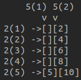
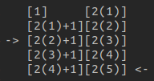
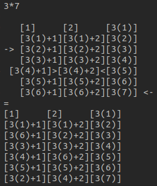

# Totient multiplicativity proof for primes

**$\phi(xy) = \phi(x)\phi(y) $**

## Example

Let's start with an example with 2 simple primes. The example looks stupid but it's easily formalizable and works for every pair of primes.
  
$2*5 = 10$  
$\phi(10) = \phi(2)\phi(5) = 4$  
$\phi(5) = 4 = \{1, 2, 3, 4\}$  
$\phi(2) = 1 = \{1\}$

- $5$ numbers share the $2$ divisor with whole group
- $2$ numbers share the $5$ divisor with whole group

Since the two conditions above coexist, there are $5 + 2$ numbers which share either $2$ or $5$ as divisor.  
From this reasoning we have to remove $1$ element because $10$ is considered twice $(2(5), 5(2))$ then:
  
$5 * 2 - (5 + 2 - 1) = 4$  
$\phi(10) = 4 = \{1, 3, 7, 9\}$

## Formalization

We take 2 primes m,n, then:
  
$\phi(mn) = m * n - (m + n -1)$  
$m * n - m - n + 1 = (m - 1)(n - 1)$

where

$\phi(m) = m - 1$  
$\phi(n) = n - 1$  

## Further refinition

 The scheme above looks a little bit messy, and seems like it does not follow a structured rule, let's refine it taking another example.

## New. ex. $\phi(3*7)$

 Before delving into the next example, let's refine the scheme above to make it more structured and understand my point. 

Here the structure follows a structured reasoning, but our 1st $5$ non-coprime element is not positioned in the last line, does this breaks our proof? Here we could simply swap that element with $[2(4)+1]$ and the game would be done. But what would happen when we have more than $1$ co-factor i.e in $3*7$? We know that there will be $3$ elements which share $7$ as co-factor, does this break our formalization? Because having $2$ elements to remove around and not removing the last line would mean to rebuild the formalization. 
It turns out that following the structure of the schemes proposed, it's always possible to swap every co-factor in the last line, breaking the structured format of the scheme but preserving formalization. 
Taken $a,b$ where $b > a$ there will be $a$ elements which share the $b$ cofactor, this means that they will always be positionable in the last line (of $a$ elements). This will be even more clear looking at the $3*7$ example.  

  

