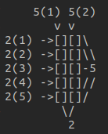

# Totient mult. demon.
**$\phi(xy) = \phi(x)\phi(y) $**
## Example

Let's start with an example with 2 simple primes. The example looks stupid but it's easily formalizable and works for every pair of primes. 
$2*5 = 10$  
$\phi(10) = \phi(2)\phi(5) = 4$  
$\phi(5) = 4 = \{1, 2, 3, 4\}$  
$\phi(2) = 1 = \{1\}$  

- 5 numbers share the '2' divisor with whole group  
- 2 numbers share the '5' divisor with whole group  
Since the two conditions above coexist, the group can be divided 5 + 2 times (by 5 + 2 numbers).  
From this reasoning we have to remove 1 element because '10' is considered twice (2(5), 5(2)) then:  

$5 * 2 - \(5 + 2 - 1\) = 4$  
$\phi(10) = 4 = \{1, 3, 7, 9\}$  

## Formalization

We take 2 primes m,n, then:  
**$\phi(mn) = m * n - \(m + n -1\) $**  
**$m * n - m - n + 1 = \(m - 1\)\(n - 1\) $ _**  
where  
$\phi(m) = m - 1$  
$\phi(n) = n - 1$  

